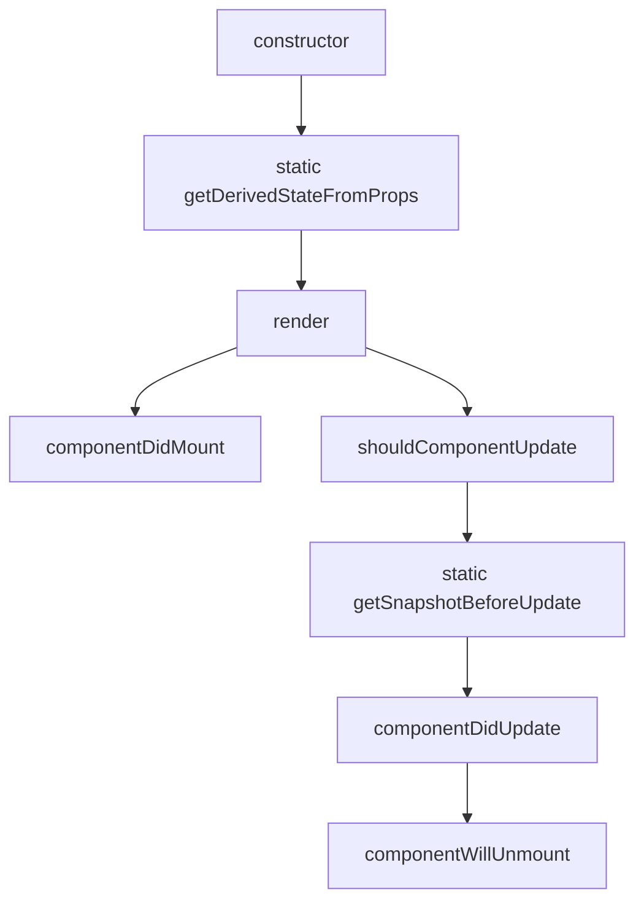
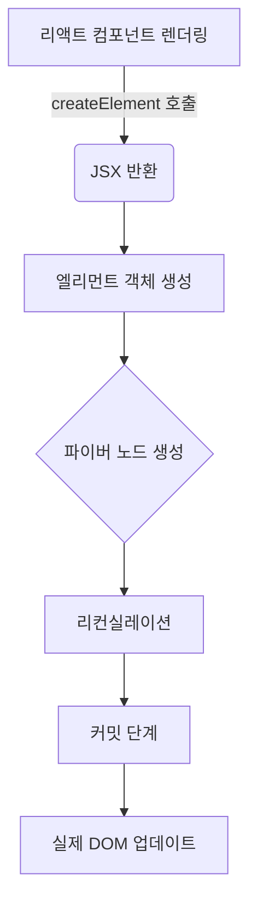

# 02장: 리액트 핵심 요소 깊게 살펴보기

리액트를 이루는 핵심 요소들을 깊게 살펴보고, 리액트의 렌더링 과정을 이해하는 장입니다.

<br>

- [02장: 리액트 핵심 요소 깊게 살펴보기](#02장-리액트-핵심-요소-깊게-살펴보기)
  - [2.1 JSX란?](#21-jsx란)
    - [2.1.1 JSX의 정의](#211-jsx의-정의)
      - [JSXElement](#jsxelement)
      - [JSXElementName](#jsxelementname)
      - [JSXAttributes](#jsxattributes)
    - [JSXChildren](#jsxchildren)
      - [JSXStrings](#jsxstrings)
    - [2.1.2 JSX 예제](#212-jsx-예제)
    - [2.1.3 JSX는 어떻게 자바스크립트에서 변환될까?](#213-jsx는-어떻게-자바스크립트에서-변환될까)
    - [2.1.4 정리](#214-정리)
  - [2.2 가상 DOM과 리액트 파이버](#22-가상-dom과-리액트-파이버)
    - [2.2.1 DOM과 브라우저 렌더링 과정](#221-dom과-브라우저-렌더링-과정)
      - [DOM(Document Object Model)](#domdocument-object-model)
      - [브라우저가 웹 사이트 접근 요청을 받고 화면을 그리는 과정](#브라우저가-웹-사이트-접근-요청을-받고-화면을-그리는-과정)
      - [CRP(Critical Rendering Path):](#crpcritical-rendering-path)
    - [2.2.2 가상 DOM의 탄생 배경](#222-가상-dom의-탄생-배경)
    - [2.2.3 가상 DOM을 위한 아키텍처, 리액트 파이버](#223-가상-dom을-위한-아키텍처-리액트-파이버)
    - [2.2.4 파이버와 가상 DOM](#224-파이버와-가상-dom)
    - [2.2.5 정리](#225-정리)
  - [2.3 클래스형 컴포넌트와 함수형 컴포넌트](#23-클래스형-컴포넌트와-함수형-컴포넌트)
    - [2.3.1 클래스형 컴포넌트](#231-클래스형-컴포넌트)
      - [생명주기(life cycle) 메서드가 실행되는 시점](#생명주기life-cycle-메서드가-실행되는-시점)
      - [클래스 컴포넌트의 생명주기 메서드 호출 순서](#클래스-컴포넌트의-생명주기-메서드-호출-순서)
    - [2.3.2 함수형 컴포넌트](#232-함수형-컴포넌트)
    - [2.3.3 함수형 컴포넌트 vs. 클래스형 컴포넌트](#233-함수형-컴포넌트-vs-클래스형-컴포넌트)
    - [2.3.4 정리](#234-정리)
  - [2.4 렌더링은 어떻게 일어나는가?](#24-렌더링은-어떻게-일어나는가)
    - [2.4.1 리액트의 렌더링이란?](#241-리액트의-렌더링이란)
    - [2.4.2 리액트의 렌더링이 일어나는 이유](#242-리액트의-렌더링이-일어나는-이유)
    - [2.4.3 리액트의 렌더링 프로세스](#243-리액트의-렌더링-프로세스)
    - [2.4.4 렌더와 커밋](#244-렌더와-커밋)
    - [2.4.5 일반적인 렌더링 시나리오 살펴보기](#245-일반적인-렌더링-시나리오-살펴보기)
    - [2.4.6 정리](#246-정리)
  - [2.5 컴포넌트와 함수의 무거운 연산을 기억해 두는 메모이제이션](#25-컴포넌트와-함수의-무거운-연산을-기억해-두는-메모이제이션)
    - [2.5.1 주장 1: 섣부른 최적화는 독이다, 꼭 필요한 곳에만 메모이제이션을 추가하자](#251-주장-1-섣부른-최적화는-독이다-꼭-필요한-곳에만-메모이제이션을-추가하자)
    - [2.5.2 주장 2: 렌더링 과정의 비용은 비싸다, 모조리 메모이제이션해 버리자](#252-주장-2-렌더링-과정의-비용은-비싸다-모조리-메모이제이션해-버리자)
    - [2.5.3 결론 및 정리](#253-결론-및-정리)
  - [References](#references)
  - [Articles](#articles)

<br>

## 2.1 JSX란?

- JSX는 리액트(React)에서 사용되는 독자적인 문법으로, JavaScript XML의 약자입니다.
- JSX는 XML과 유사한 내장형 구문을 가지고 있어서 HTML과 비슷한 형태로 JavaScript 코드 안에 마크업을 작성할 수 있습니다. 그러나 JSX는 자바스크립트 표준 문법이 아니며, 자바스크립트 엔진에서 바로 실행되지 않습니다. 대신, JSX는 바벨과 같은 트랜스파일러를 통해 일반 자바스크립트 형태의 코드로 변환되어 실행됩니다.
- JSX의 설계 목적은 다양한 트랜스파일러에서 다양한 속성을 가진 트리 구조를 토큰화해 ECMAScript로 변환하는 것입니다.

```jsx
// JSX 문법 예제
import React from "react";

function App() {
  const name = "B";
  const isLoggedIn = true;

  return (
    <div>
      <h1>Hello, {name}!</h1>
      {isLoggedIn ? <p>Welcome!</p> : <p>Please log in.</p>}
    </div>
  );
}

export default App;
```

### 2.1.1 JSX의 정의

#### JSXElement

JSXElement는 JSX 문법을 사용하여 생성한 React 컴포넌트를 나타냅니다. JSXElement는 HTML 태그와 유사한 구조를 가지며, React 컴포넌트를 생성하고 렌더링하는 데 사용됩니다.

| 구성 요소             | 설명                                                                                     | 예시                            |
| --------------------- | ---------------------------------------------------------------------------------------- | ------------------------------- |
| JSXOpeningElement     | JSXElement의 시작 부분을 나타내며, `<`로 시작하고 태그 이름과 속성을 포함합니다.         | `<div>`                         |
| JSXClosingElement     | JSXElement의 끝 부분을 나타내며, `</`로 시작하고 태그 이름을 포함합니다.                 | `</div>`                        |
| JSXSelfClosingElement | 자체 닫히는 태그를 나타내며, `<`로 시작하고 태그 이름과 속성을 포함하며, `/`로 닫습니다. | ``       |
| JSXFragment           | 빈 태그로 이루어진 구조를 나타내며, 여러 컴포넌트를 묶어서 반환할 수 있습니다.           | `<></>`                         |
| JSXElement            | 위의 구성 요소를 조합하여 JSXElement를 생성할 수 있습니다.                               | `<div><span>Hello</span></div>` |

#### JSXElementName

JSXElementName은 JSXElement의 이름을 나타냅니다. JSXElementName은 JSX 문법에서 사용되는 요소의 이름을 정의합니다.

| 구성 요소           | 설명                                                                                | 예시                 |
| ------------------- | ----------------------------------------------------------------------------------- | -------------------- |
| JSXIdentifier       | JSXElementName의 식별자로, 소문자로 시작하는 컴포넌트의 이름입니다.                 | `<div>`              |
| JSXNamespacedName   | 네임스페이스가 있는 JSXElementName으로, 콜론으로 구분된 접두사를 포함한 이름입니다. | `<my:component>`     |
| JSXMemberExpression | 객체의 속성에 접근하는 멤버 표현식으로 구성된 JSXElementName입니다.                 | `<MyComponent.Item>` |

| JSXElementName          | 구성 요소를 조합하여 JSXElementName을 생성할 수 있습니다.                                  |
| ----------------------- | ------------------------------------------------------------------------------------------ |
| `<식별자>`              | JSXIdentifier를 사용하여 간단한 JSXElementName을 생성합니다.                               |
| `<네임스페이스:식별자>` | JSXNamespacedName을 사용하여 네임스페이스가 지정된 컴포넌트 이름을 생성합니다.             |
| `<식별자.식별자>`       | JSXMemberExpression을 사용하여 객체의 속성을 나타내는 복합적인 컴포넌트 이름을 생성합니다. |

#### JSXAttributes

JSXAttributes는 JSXElement의 속성을 나타냅니다. JSXAttributes는 HTML 태그의 속성과 유사한 방식으로 작성되며, 컴포넌트에 추가적인 정보를 전달하는 데 사용됩니다.

| 구성 요소          | 설명                                                                              | 예시                              |
| ------------------ | --------------------------------------------------------------------------------- | --------------------------------- |
| JSXAttribute       | JSX 요소에 추가되는 속성을 나타냅니다.                                            | `type="text"`                     |
| JSXAttributeName   | JSX 속성의 이름을 나타냅니다.                                                     | `type`                            |
| JSXAttributeValue  | JSX 속성의 값을 나타내며, 문자열 또는 중괄호 `{}`로 감싼 표현식이 될 수 있습니다. | `"text"` 또는 `{this.state.text}` |
| JSXSpreadAttribute | 객체의 속성들을 JSX 요소에 스프레드 문법을 사용하여 전개합니다.                   | `{...props}`                      |

| JSXAttributes의 예                    | 설명                                                                                         |
| ------------------------------------- | -------------------------------------------------------------------------------------------- |
| `<input type="text" />`               | `type`이라는 이름의 JSXAttribute를 사용하여 속성을 정의합니다.                               |
| `<div {...props} />`                  | `props` 객체에 있는 모든 속성을 `<div>` 요소에 스프레드 속성으로 전개합니다.                 |
| `<button {...props} type="button" />` | `props` 객체를 스프레드 속성으로 전개하고, `type` 속성을 추가하여 JSXAttribute를 조합합니다. |

### JSXChildren

JSXChild는 JSXChildren을 구성하는 자식 요소를 나타냅니다. JSXChild는 JSXText, JSXElement, JSXFragment, JSXChildExpression 중 하나일 수 있으며, 여러 개의 자식 요소가 포함될 수 있습니다.

| 구성 요소          | 설명                                                                                                   | 예시                               |
| ------------------ | ------------------------------------------------------------------------------------------------------ | ---------------------------------- |
| JSXText            | JSXElement 안에 직접 작성된 텍스트 내용을 나타내며, HTML 태그가 아닌 일반 텍스트로 처리됩니다.         | "Hello, world!"                    |
| JSXElement         | HTML 태그나 다른 컴포넌트를 나타내며, 중첩된 구조로 작성할 수 있고 JSXChildren을 가질 수 있습니다.     | `<div>Hello, world!</div>`         |
| JSXFragment        | 여러 자식 요소를 그룹화하지만 추가적인 DOM 엘리먼트를 추가하지 않는 컨테이너 역할을 합니다.            | `<><ChildA /><ChildB /></>`        |
| JSXChildExpression | 중괄호 `{}`로 감싼 JavaScript 표현식을 나타냅니다. JSXElement 안에서 동적인 값을 표현할 때 사용됩니다. | `{true ? <ChildA /> : <ChildB />}` |

| JSXChildren | 구성 요소를 조합하여 JSXChildren을 생성할 수 있습니다.                                       |
| ----------- | -------------------------------------------------------------------------------------------- |
| `<텍스트>`  | JSXText를 사용하여 간단한 텍스트 노드를 자식 요소로 생성합니다.                              |
| `<></>`     | JSXFragment를 사용하여 여러 자식 요소를 그룹화하지만, 추가 DOM 엘리먼트 없이 생성합니다.     |
| `{표현식}`  | JSXChildExpression을 사용하여 JavaScript 표현식을 계산하여 그 결과를 자식 요소로 생성합니다. |

#### JSXStrings

JSXStrings은 JSXElement에서 사용되는 문자열 리터럴을 나타냅니다. JSXStrings은 JSX 속성 값이나 텍스트 노드로 사용됩니다.

| 구성 요소     | 설명                                                                                                    |
| ------------- | ------------------------------------------------------------------------------------------------------- |
| 일반 문자열   | 일반적인 문자열 리터럴을 나타냅니다. 작은 따옴표(') 또는 큰 따옴표(")로 감싸져 있습니다.                |
| 템플릿 리터럴 | 백틱(`)으로 감싸진 템플릿 리터럴을 나타냅니다. 템플릿 리터럴 안에는 변수나 표현식을 삽입할 수 있습니다. |

### 2.1.2 JSX 예제

### 2.1.3 JSX는 어떻게 자바스크립트에서 변환될까?

- [@babel/plugin-transform-react-jsx 플러그인](https://babeljs.io/docs/babel-plugin-transform-react-jsx)을 사용하면 JSX를 일반 자바스크립트로 변환할 수 있음

### 2.1.4 정리

<br>

## 2.2 가상 DOM과 리액트 파이버

### 2.2.1 DOM과 브라우저 렌더링 과정

#### DOM(Document Object Model)

HTML 문서의 구조를 표현하는 트리 구조 형태의 데이터 모델로, 브라우저가 HTML 문서를 파싱한 결과물

#### 브라우저가 웹 사이트 접근 요청을 받고 화면을 그리는 과정

1. **URL 입력 또는 링크 클릭:** 사용자가 웹 사이트의 URL을 입력하거나 링크를 클릭하여 웹 사이트에 접근 요청을 보냅니다.
2. **DNS 조회:** 브라우저는 해당 URL에 대한 DNS 조회를 수행하여 서버의 IP 주소를 가져옵니다.
3. **HTTP 요청:** 브라우저는 서버에 HTTP 요청을 보내고, 요청 메서드(GET, POST 등)와 함께 요청 헤더와 데이터를 포함시킵니다.
4. **서버의 응답 처리:** 서버는 요청을 받고, 요청에 따라 필요한 데이터를 처리하여 HTTP 응답을 생성합니다.
5. **응답의 파싱:** 서버는 생성된 응답을 브라우저로 보냅니다. 응답은 일반적으로 HTML, CSS, JavaScript, 이미지 등의 리소스로 구성됩니다. 브라우저는 응답을 받아서 파싱하고, HTML 문서를 DOM(Document Object Model) 트리로 변환합니다. CSS 파일도 파싱하여 CSSOM(CSS Object Model) 트리를 생성합니다.
6. **리플로우:** DOM 트리와 CSSOM 트리를 사용하여 브라우저는 화면에 요소들을 배치하고 스타일을 적용합니다. 이 과정을 리플로우(Reflow)라고도 합니다. 리플로우는 요소의 크기, 위치, 레이아웃 등을 계산하는 과정입니다.
7. **페인팅:** 리플로우 후, 브라우저는 화면에 내용을 그리기 위해 페인팅(Painting) 작업을 수행합니다. 페인팅은 실제로 화면에 픽셀을 그리는 과정입니다.
8. **사용자 상호작용 및 JavaScript 실행:** 내용이 그려진 후, 브라우저는 사용자의 입력을 대기하거나 애니메이션 및 이벤트 처리를 위해 JavaScript 코드를 실행합니다.

#### CRP(Critical Rendering Path):


### 2.2.2 가상 DOM의 탄생 배경

- <u>가상 DOM</u>은 실제 DOM의 메모리 상 복사본입니다. 데이터 변경이 있을 때, 리액트 같은 라이브러리는 메모리에서 변경 사항을 계산하고 최종적으로만 실제 DOM을 업데이트하여 불필요한 렌더링을 줄이고 성능을 향상시킵니다.
- 리치 해리스는 ["가상 DOM은 순수한 오버헤드입니다"](https://svelte.dev/blog/virtual-dom-is-pure-overhead)라는 글에서 리액트와 같은 프레임워크에서 널리 알려진 기능인 가상 DOM이 많은 개발자가 생각하는 것만큼 효율적이지 않다고 주장합니다. 이어서 그는 이 기능의 작동 방식을 비판하며 대안적인 접근 방식을 제시합니다.

### 2.2.3 가상 DOM을 위한 아키텍처, 리액트 파이버


### 2.2.4 파이버와 가상 DOM

### 2.2.5 정리

<br>

## 2.3 클래스형 컴포넌트와 함수형 컴포넌트

- 리액트 0.14버전부터 함수 컴포넌트가 도입되었고, 당시에는 상태나 생명주기 메서드 없이 단순히 `props`를 이용해 UI를 렌더링하는 데 사용되었습니다. 리액트 16.8버전에서 Hooks가 소개된 이후로는 함수 컴포넌트도 상태 관리와 생명주기 기능을 사용할 수 있게 되어, 클래스 컴포넌트 대신 널리 쓰이기 시작했습니다.
  - (참고) [무상태 함수형 컴포넌트(Stateless Function Components)](https://legacy.reactjs.org/blog/2015/10/07/react-v0.14.html#stateless-function-components)

### 2.3.1 클래스형 컴포넌트

- React 16.8 이전에는 대부분의 컴포넌트가 클래스 형태로 작성되었습니다.
- 클래스 컴포넌트를 만들려면 `extends` 키워드를 사용하여 `React.Component`나 `React.PureComponent`를 확장해야 합니다.
- `React.Component`는 기본 컴포넌트 클래스로 상태(state)와 라이프사이클 메서드를 사용할 수 있게 해주고,
- `React.PureComponent`는 성능 최적화를 위해 자동으로 `shouldComponentUpdate`를 구현한 클래스입니다.
- 클래스형 컴포넌트를 만들 때 주로 `props(속성)`, `state(상태)`, `method(메서드)`를 사용하여 정의

```jsx
import React, { Component } from "react";

class MyComponent extends Component {
  constructor(props) {
    super(props);
    this.state = {
      count: 0,
    };
  }

  componentDidMount() {
    console.log("Component mounted");
  }

  componentDidUpdate() {
    console.log("Component updated");
  }

  componentWillUnmount() {
    console.log("Component will unmount");
  }

  handleClick = () => {
    this.setState((prevState) => ({
      count: prevState.count + 1,
    }));
  };

  render() {
    return (
      <div>
        <h1>Count: {this.state.count}</h1>
        <button onClick={this.handleClick}>Increase Count</button>
      </div>
    );
  }
}

export default MyComponent;
```

#### 생명주기(life cycle) 메서드가 실행되는 시점

- 마운트(mount): 컴포넌트가 DOM에 추가되는 것을 의미합니다. 이때 `constructor`, `render`, `componentDidMount` 메서드가 실행됩니다.
- 업데이트(update): 컴포넌트의 상태가 변경되는 것을 의미합니다. 이때 `render`, `componentDidUpdate`, `shouldComponentUpdate`, `getSnapshotBeforeUpdate` 메서드가 실행됩니다.
- method(메서드): 컴포넌트가 DOM에서 제거되는 것을 의미합니다. 이때 `componentWillUnmount` 메서드가 실행됩니다.

각 생명주기 메서드는 특정 시점에 자동으로 호출되며, 해당 시점에 원하는 동작을 구현할 수 있습니다. 이를 활용하여 컴포넌트의 초기화, 데이터 로딩, 상태 업데이트 등을 관리할 수 있습니다.

| 생명주기 메서드           | 실행 시점        | 설명                                                     |
| ------------------------- | ---------------- | -------------------------------------------------------- |
| `constructor`             | 마운트           | 컴포넌트의 인스턴스가 생성될 때 호출되는 메서드입니다.   |
| `render`                  | 마운트, 업데이트 | 컴포넌트의 UI를 렌더링하는 메서드입니다.                 |
| `componentDidMount`       | 마운트           | 컴포넌트가 DOM에 추가된 후 호출되는 메서드입니다.        |
| `componentDidUpdate`      | 업데이트         | 컴포넌트의 업데이트가 완료된 후 호출되는 메서드입니다.   |
| `componentWillUnmount`    | 언마운트         | 컴포넌트가 DOM에서 제거되기 전에 호출되는 메서드입니다.  |
| `shouldComponentUpdate`   | 업데이트         | 컴포넌트의 업데이트 여부를 결정하는 메서드입니다.        |
| `getSnapshotBeforeUpdate` | 업데이트         | 실제 DOM에 변화가 반영되기 직전에 호출되는 메서드입니다. |

#### 클래스 컴포넌트의 생명주기 메서드 호출 순서



- **클래스 컴포넌트이 한계**:

### 2.3.2 함수형 컴포넌트

- 함수형 컴포넌트는 클래스형 컴포넌트와 달리 `state`나 `lifecycle` 메서드를 사용할 수 없습니다. 그러나 React 16.8 이후부터는 Hooks API를 사용하여 함수형 컴포넌트에서도 상태 관리와 생명주기 기능을 사용할 수 있게 되었습니다.

### 2.3.3 함수형 컴포넌트 vs. 클래스형 컴포넌트

- 생명 주기 메서드의 부재
- 함수형 컴포넌트와 렌더링된 값
- 클래스형 컴포넌트를 공부해야 할까?

### 2.3.4 정리

<br>

## 2.4 렌더링은 어떻게 일어나는가?

### 2.4.1 리액트의 렌더링이란?

### 2.4.2 리액트의 렌더링이 일어나는 이유

### 2.4.3 리액트의 렌더링 프로세스

**리액트 코드가 파이버 트리로 변환되는 과정**



### 2.4.4 렌더와 커밋

### 2.4.5 일반적인 렌더링 시나리오 살펴보기

### 2.4.6 정리

<br>

## 2.5 컴포넌트와 함수의 무거운 연산을 기억해 두는 메모이제이션

### 2.5.1 주장 1: 섣부른 최적화는 독이다, 꼭 필요한 곳에만 메모이제이션을 추가하자

### 2.5.2 주장 2: 렌더링 과정의 비용은 비싸다, 모조리 메모이제이션해 버리자

### 2.5.3 결론 및 정리

## References

- [React Hooks](https://reactjs.org/docs/hooks-intro.html)
- [JSX Introduction](https://facebook.github.io/jsx/#sec-introl)
- [React v16.8: The One With Hooks](https://legacy.reactjs.org/blog/2019/02/06/react-v16.8.0.html)
- [MDN, Populating the page: how browsers work - Web performance](https://developer.mozilla.org/en-US/docs/Web/Performance/How_browsers_work)

## Articles

- [How your browser loads, parses, and renders a webpage](https://www.zachgollwitzer.com/posts/how-browser-loads-parses-renders-webpage)
- [브라우저의 작동 방식](https://web.dev/articles/howbrowserswork?hl=ko)
- [가상 DOM: 블록으로 돌아가기 - 가상 DOM의 동작 원리](https://million.dev/blog/virtual-dom#visual-example)
- [Difference between Virtual DOM and Real DOM](https://www.geeksforgeeks.org/difference-between-virtual-dom-and-real-dom/)
- [LogRocket Blog, How browser rendering works — behind the scenes](https://blog.logrocket.com/how-browser-rendering-works-behind-scenes/)
