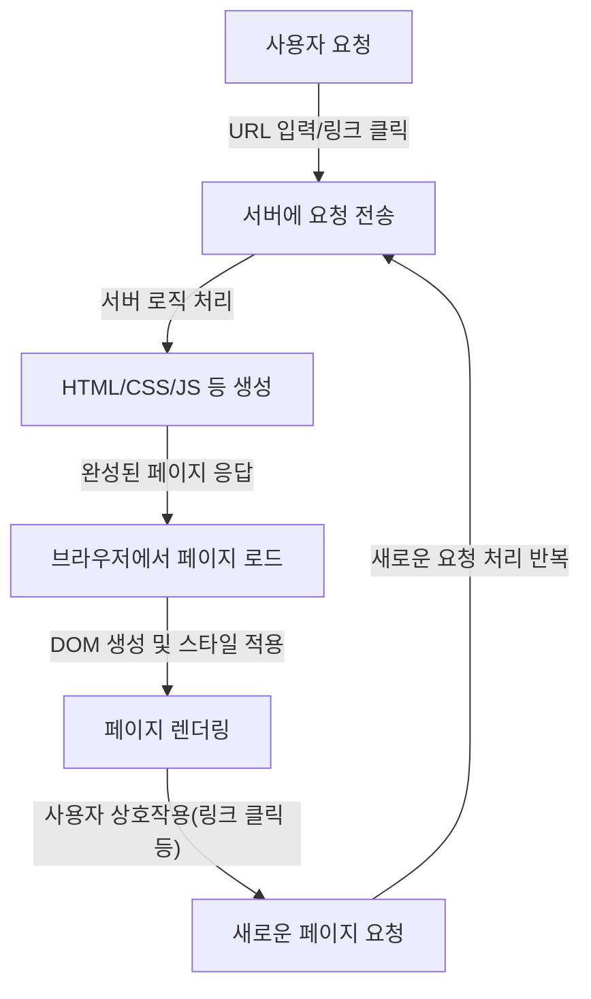
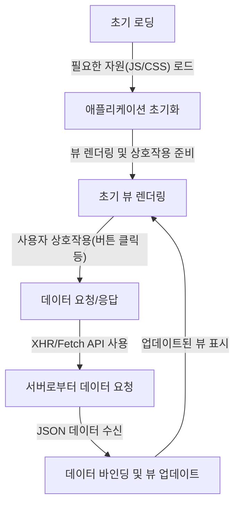
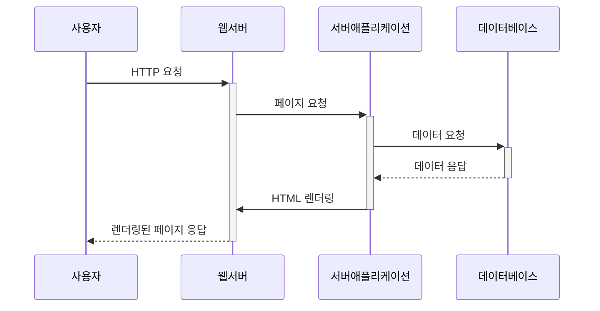

# 04장: 서버 사이드 렌더링

 

- [04장: 서버 사이드 렌더링](#04장-서버-사이드-렌더링)
  - [4.1 서버 사이드 렌더링이란?](#41-서버-사이드-렌더링이란)
    - [4.1.1 싱글 페이지 애플리케이션의 세상](#411-싱글-페이지-애플리케이션의-세상)
      - [싱글 페이지 애플리케이션(SPA; Single Page Application)](#싱글-페이지-애플리케이션spa-single-page-application)
      - [전통적인 방식의 어플리케이션과 싱글 페이지 어플리케이션의 작동 비교](#전통적인-방식의-어플리케이션과-싱글-페이지-어플리케이션의-작동-비교)
      - [싱글 페이지 렌더링 방식의 유행과 JAM스택의 등장](#싱글-페이지-렌더링-방식의-유행과-jam스택의-등장)
      - [새로운 패러다임의 웹서비스를 향한 요구](#새로운-패러다임의-웹서비스를-향한-요구)
    - [4.1.2 서버 사이드 렌더링이란?](#412-서버-사이드-렌더링이란)
    - [4.1.3 `SPA`와 `SSR`을 모두 알아야 하는 이유](#413-spa와-ssr을-모두-알아야-하는-이유)
    - [4.1.4 정리](#414-정리)
  - [4.2 서버 사이드 렌더링을 위한 리액트 API 살펴보기](#42-서버-사이드-렌더링을-위한-리액트-api-살펴보기)
    - [4.2.1 `renderToString`](#421-rendertostring)
    - [4.2.2 `renderToStaticMarkup`](#422-rendertostaticmarkup)
    - [4.2.3 `renderToNodeStream`](#423-rendertonodestream)
    - [4.2.4 `renderToStaticNodeStream`](#424-rendertostaticnodestream)
    - [4.2.5 `hydrate`](#425-hydrate)
    - [4.2.6 서버 사이드 렌더링 예제 프로젝트](#426-서버-사이드-렌더링-예제-프로젝트)
    - [4.2.7 정리](#427-정리)
  - [4.3 Next.js 톺아보기](#43-nextjs-톺아보기)
    - [4.3.1 Next.js란?](#431-nextjs란)
    - [4.3.2 Next.js 시작하기](#432-nextjs-시작하기)
    - [4.3.3 `Data Fetching`](#433-data-fetching)
    - [4.3.4 스타일 적용하기](#434-스타일-적용하기)
    - [4.3.5 `app.tsx` 응용하기](#435-apptsx-응용하기)
    - [4.3.6 `next.config.js` 살펴보기](#436-nextconfigjs-살펴보기)
    - [4.3.7 정리](#437-정리)
  - [Related Articles](#related-articles)

 

## 4.1 서버 사이드 렌더링이란?

### 4.1.1 싱글 페이지 애플리케이션의 세상

#### 싱글 페이지 애플리케이션(SPA; Single Page Application)
싱글 페이지 애플리케이션은 전체 페이지를 새로고침하지 않고 동적으로 내용을 업데이트하여 사용자에게 빠르고 부드러운 경험을 제공하는 웹 애플리케이션입니다.

1. **싱글 페이지 애플리케이션의 개념**
   - 싱글 페이지 애플리케이션은 전체 페이지를 새로고침하지 않고 내용을 업데이트하는 웹 애플리케이션입니다.
   - 클라이언트 측 렌더링
   - 싱글 페이지 애플리케이션은 클라이언트 측에서 렌더링됩니다.
2. **렌더링 과정**
   - 초기 HTML, CSS, JavaScript 파일을 다운로드합니다.
   - JavaScript를 사용하여 동적으로 데이터를 가져와 화면에 표시합니다.
   - 서버로부터 필요한 데이터만 가져와서 렌더링하므로 빠르고 부드러운 사용자 경험을 제공합니다.
3. **초기 로딩 시간**
   - 클라이언트 측에서 렌더링되기 때문에 초기 로딩 시간이 길어질 수 있습니다.
   - 코드 스플리팅(Code Splitting)이나 레이지 로딩(Lazy Loading)과 같은 기술을 사용하여 해결할 수 있습니다.

#### 전통적인 방식의 어플리케이션과 싱글 페이지 어플리케이션의 작동 비교

**[전통적인 웹 페이지 라이프사이클]**

- **요청(Request)**: 사용자가 웹 페이지를 요청하면 서버는 요청을 받고 페이지를 처리하기 시작합니다.
- **처리(Processing)**: 서버는 HTML, CSS, JavaScript 등의 파일을 처리하여 응답을 준비합니다.
- **응답(Response)**: 서버는 완성된 웹 페이지를 사용자의 웹 브라우저로 보냅니다.
- **렌더링(Rendering)**: 웹 브라우저는 받은 자료를 해석하여 화면에 표시합니다.
- **상호작용(Interaction)**: 사용자가 페이지와 상호작용하게 되면, 새로운 요청이 발생하고 전체 과정이 반복됩니다.

**[SPA 라이프사이클]**

- **초기 로딩(Initial Loading)**: SPA는 처음에 필요한 모든 자원을 한 번에 로딩합니다. 이는 초기 로딩 시간이 길어질 수 있지만, 이후의 상호작용에서는 빠른 반응성을 제공합니다.
- **뷰 렌더링(View Rendering)**: 사용자의 상호작용에 따라 필요한 부분만을 동적으로 렌더링합니다. 이는 전체 페이지를 다시 로드할 필요가 없기 때문에 성능 향상을 가져옵니다.
- **데이터 통신(Data Communication)**: 서버와의 통신은 주로 AJAX나 Fetch API를 사용하여 비동기적으로 이루어지며, 필요한 데이터만을 주고받습니다.
- **상태 관리(State Management)**: SPA는 클라이언트 측에서 상태를 관리합니다. 이를 통해 사용자 경험이 향상되며, 서버 부하가 줄어듭니다.

#### 싱글 페이지 렌더링 방식의 유행과 JAM스택의 등장

웹 스택은 웹 애플리케이션 개발에 사용되는 기술들의 조합을 의미합니다.
초기의 웹 스택은 상대적으로 단순했으나, 시간이 흐르면서 기술의 발전, 사용자의 요구, 시장의 동향 등에 따라 변화해왔습니다.

**[웹 스택의 변화]**
1. **초기 웹 개발**
     - 정적 웹사이트: HTML 기반의 단순한 정적 웹사이트 구축
     - CGI 활용: 초기 서버 사이드 스크립팅을 위한 CGI 기술 사용

2. **LAMP 스택의 등장**
     - 동적 웹 페이지: 사용자의 요구에 따른 동적 웹 페이지 생성을 위해 LAMP 스택이 널리 사용되기 시작
     - 서버 사이드 렌더링: LAMP는 서버에서 페이지를 렌더링하여 클라이언트에 전송하는 방식을 채택

      | 구성 요소 | 기술                    | 설명                                                  |
      |-----------|-------------------------|-------------------------------------------------------|
      | L         | Linux                   | 오픈 소스 운영 체제로, 서버의 기반을 이룹니다.       |
      | A         | Apache                  | 웹 서버 소프트웨어로, 웹 요청을 처리합니다.           |
      | M         | MySQL                   | 관계형 데이터베이스 시스템으로, 데이터를 관리합니다. |
      | P         | PHP                     | 서버 사이드 스크립트 언어로, 동적 웹 페이지를 생성합니다. |

1. **AJAX와 Web 2.0의 도래**
     - AJAX 기술: A페이지 새로고침 없이 서버와 통신을 가능하게 하는 AJAX 기술 도입
     - 인터랙티브 웹: 사용자 참여와 경험을 중시하는 인터랙티브 웹 애플리케이션 개발이 증가

2. **프론트엔드와 백엔드의 분리**
     - `MVC` 패턴: 애플리케이션의 구조화와 유지보수성 향상을 위한 MVC 패턴 채택
     - 역할의 명확한 분담: 프론트엔드와 백엔드 개발의 명확한 역할 분리

3. **SPA와 모던 프론트엔드 프레임워크**
     - SPA의 인기: 빠른 로딩과 부드러운 사용자 경험을 제공하는 SPA 개발 증가.
     - 프론트엔드 프레임워크: React, Angular, Vue.js 등 현대적인 프론트엔드 프레임워크의 사용 확대.되었습니다.

4. **JAMstack과 서버리스 아키텍처**
     - JAM 스택: `JavaScript`, `API`, `Markup`을 기반으로 한 모던 웹 개발 방식
     - 정적 사이트 생성기와 서버리스 아키텍처: 빌드 시간에 생성되는 정적 사이트와 서버리스 기능의 활용 증가
       - 정적 사이트 생성기: `Gatsby`, `Next.js` 등의 도구를 통해 정적 사이트 생성
       - 서버리스 아키텍처: `AWS Lambda`, `Azure Functions` 등을 활용한 서버리스 컴퓨팅

      | 구성 요소 | 기술                    | 설명                                                  |
      |-----------|-------------------------|-------------------------------------------------------|
      | J         | JavaScript              | 클라이언트 사이드 스크립트 언어로, 인터랙티브한 웹 페이지를 만듭니다. |
      | A         | API                     | 백엔드 로직과 데이터를 제공하는 인터페이스입니다.    |
      | M         | Markup                  | HTML/CSS와 같은 마크업 언어로, 웹 페이지의 구조를 정의합니다. |

5. **MERN 스택의 대두**
     - MERN 스택: `MongoDB`, `Express.js`, `React`, `Node.js`를 포함하는 풀스택 개발 환경.
     - `JavaScript` 일관성: 클라이언트와 서버 양쪽에서 `JavaScript`를 사용하여 개발의 일관성과 효율성 향상.
     - SPA와 RESTful API: `React`를 이용한 `SPA` 구축과 `Express.js`를 활용한 `RESTful API` 개발이 가능.

    | 구성 요소 | 기술                    | 설명                                                  |
    |-----------|-------------------------|-------------------------------------------------------|
    | M         | MongoDB                 | NoSQL 데이터베이스로, JSON 형식의 문서를 저장합니다.  |
    | E         | Express.js              | Node.js 위에서 동작하는 웹 애플리케이션 프레임워크입니다. |
    | R         | React                   | 사용자 인터페이스를 구축하기 위한 JavaScript 라이브러리입니다. |
    | N         | Node.js                 | 서버 사이드 자바스크립트 실행 환경입니다.             |

6. **API 중심 아키텍처와 마이크로서비스**
     - `RESTful API`와 `GraphQL`: 백엔드 로직과 데이터를 제공하는 표준화된 API가 중요해졌습니다.
     - 마이크로서비스: 서비스가 작고 독립적인 단위로 분리되면서, 확장성과 유지보수성이 향상되었습니다.

7. **클라우드 네이티브와 DevOps**
     - 클라우드 네이티브 애플리케이션: 클라우드 환경에 최적화된 애플리케이션 개발 방식이 주목받았습니다.
     - `DevOps` 문화: 개발과 운영의 긴밀한 통합을 위한 `DevOps` 문화가 확산되었습니다.

웹 스택의 변화는 끊임없이 진행 중입니다.
각 시대의 기술적 요구사항과 시장의 요구에 맞춰 새로운 기술과 방법론이 지속적으로 등장하고 있습니다.

#### 새로운 패러다임의 웹서비스를 향한 요구

### 4.1.2 서버 사이드 렌더링이란?

서버 사이드 렌더링(Server Side Rendering, SSR)은 웹 애플리케이션의 페이지를 사용자의 브라우저로 보내기 전에 서버에서 HTML을 미리 생성하는 기술입니다.
이 방식은 클라이언트 사이드 렌더링(Client Side Rendering, CSR)과 대조되는데, CSR은 브라우저에서 JavaScript를 사용하여 동적으로 페이지를 생성합니다.

**[서버 사이드 렌더링 과정]**

1. 사용자가 웹서버에 HTTP 요청을 보냅니다.
2. 웹서버는 서버 애플리케이션에 페이지 요청을 합니다.
3. 서버 애플리케이션은 필요한 데이터를 데이터베이스에 요청합니다.
4. 데이터베이스는 요청받은 데이터를 서버 애플리케이션에게 응답합니다.
5. 서버 애플리케이션은 받은 데이터를 기반으로 HTML 페이지를 렌더링합니다.
6. 웹서버는 렌더링된 HTML 페이지를 사용자에게 응답합니다.

**[클라이언트 사이드 프레임워크(Client-side Web Frameworks)와 서버 사이드 프레임워크(Server-side Web Frameworks) 비교]**
| 구분 | 서버 사이드 자바스크립트 프레임워크 | 클라이언트 사이드 자바스크립트 프레임워크 |
|------|---------------------------------------|-----------------------------------------|
| 실행 환경 | 웹 서버에서 실행되며, 클라이언트에게 전송되기 전에 HTML을 생성합니다. | 웹 브라우저에서 실행되며, 주로 DOM 조작을 통해 사용자 인터페이스를 동적으로 만듭니다. |
| 주요 기능 | 데이터베이스 관리, 서버 로직 처리, API 제공, 세션 관리, 서버 사이드 렌더링 등 | DOM 조작, 이벤트 처리, 데이터 바인딩, 클라이언트 사이드 라우팅, 가상 DOM 사용 등 |
| 대표 예시 | `Node.js`의 `Express.js`는 가볍고 유연한 프레임워크로써 미들웨어를 쉽게 추가할 수 있고,   `Koa.js`는 더 모던하고 프로미스 기반의 미들웨어를 사용합니다.   `Hapi.js는` 구성 가능한 서버 어플리케이션을 위한 강력한 플러그인 시스템을 제공합니다. | `Angular`는 구글에서 지원하는 포괄적인 프레임워크로, 양방향 데이터 바인딩과 종속성 주입을 특징으로 합니다.   `React`는 페이스북에서 지원하는 UI 라이브러리로서, 선언적 뷰와 가상 DOM을 사용하여 효율적인 UI 업데이트를 가능하게 합니다.   `Vue.js`는 점진적으로 채택할 수 있는 아키텍처를 제공하며, 간결한 API와 높은 성능을 자랑합니다. |
| 장점 | 서버에서 처리하기 때문에 클라이언트의 컴퓨팅 자원을 절약할 수 있으며, SEO 최적화에 유리합니다. | 사용자 경험을 향상시키고, 페이지 로딩 시간을 줄일 수 있으며, 반응형 인터페이스 구현에 용이합니다. |
| 단점 | 사용자에게 보여지는 화면을 변경하기 위해서는 페이지를 새로고침해야 할 수 있으며, 서버 부하가 증가할 수 있습니다. | 초기 로딩 시간이 길어질 수 있으며, SEO 최적화가 서버 사이드 렌더링에 비해 복잡할 수 있습니다. |

**[서버 사이드 렌더링의 장/단점]**

| 장점 | 단점 |
| --- | --- |
| **빠른 초기 로딩**: 사용자가 첫 화면을 볼 때까지의 시간을 단축시킬 수 있습니다. 서버에서 미리 페이지를 렌더링하여 전송하기 때문에, 클라이언트의 자바스크립트 처리량이 감소합니다. | **서버 구성의 복잡성**: SSR을 구현하기 위해서는 서버 환경을 세팅하고 유지하는 것이 복잡할 수 있습니다. 프론트엔드와 백엔드 간의 통합이 더 까다로워지며, 서버 사이드 로직을 관리해야 합니다. |
| **SEO 최적화**: 검색 엔진은 완성된 HTML을 크롤링하여 콘텐츠를 인덱싱합니다. SSR을 사용하면 검색 엔진이 페이지를 더 잘 이해하고 높은 순위를 부여할 가능성이 증가합니다. | **서버 부하 증가**: 모든 사용자 요청에 대해 페이지를 실시간으로 렌더링해야 하므로, 트래픽이 많은 사이트에서는 서버 부하가 급격히 증가할 수 있습니다. |
| **메타 데이터 관리 용이**: 소셜 미디어 플랫폼들은 메타 데이터를 사용하여 공유된 링크의 정보를 표시합니다. SSR을 사용하면 이러한 메타 데이터를 쉽게 설정하여 콘텐츠의 공유 효과를 극대화할 수 있습니다. | **캐싱 복잡성**: 캐싱 전략을 통해 서버 부하를 줄일 수 있지만, 이는 캐싱 로직을 세밀하게 관리해야 한다는 의미이며, 때로는 상당히 복잡해질 수 있습니다. |
| **콘텐츠 일관성**: 서버에서 생성된 HTML은 모든 사용자에게 동일하게 제공됩니다. 이로 인해 사용자 경험의 일관성을 유지할 수 있으며, 데이터 동기화 문제를 줄일 수 있습니다. | **초기 서버 응답 시간**: SSR은 서버에서 페이지를 생성해야 하므로, 서버의 응답 시간이 길어질 수 있습니다. 이는 서버 성능과 최적화에 따라 달라질 수 있습니다. |

### 4.1.3 `SPA`와 `SSR`을 모두 알아야 하는 이유
SPA와 SSR은 각각의 독특한 특성과 사용 사례를 가지고 있으며, 현대 웹 개발에서는 이 두 가지 접근 방식이 종종 함께 사용되고 있습니다. 따라서 개발자는 두 기술 모두를 이해하고 상황에 맞게 적절히 적용할 수 있어야 합니다.

- 서버 사이드 렌더링 역시 만능이 아니다.
- 싱글 페이지 어플리케이션과 서버 사이드 렌더링 어플리케이션
- 현대 서버 사이드 렌더링

### 4.1.4 정리

 

## 4.2 서버 사이드 렌더링을 위한 리액트 API 살펴보기
### 4.2.1 `renderToString`
### 4.2.2 `renderToStaticMarkup`
### 4.2.3 `renderToNodeStream`
### 4.2.4 `renderToStaticNodeStream`
### 4.2.5 `hydrate`
### 4.2.6 서버 사이드 렌더링 예제 프로젝트
### 4.2.7 정리

 

## 4.3 Next.js 톺아보기
### 4.3.1 Next.js란?
### 4.3.2 Next.js 시작하기
### 4.3.3 `Data Fetching`
### 4.3.4 스타일 적용하기
### 4.3.5 `app.tsx` 응용하기
### 4.3.6 `next.config.js` 살펴보기
### 4.3.7 정리

 

## Related Articles
- [The main key difference between SPA (Single Page Application) and SSR (Server Side Rendering).](https://www.linkedin.com/pulse/main-key-difference-between-spa-single-page-ssr-server-sachin-yadav-zcncf/)