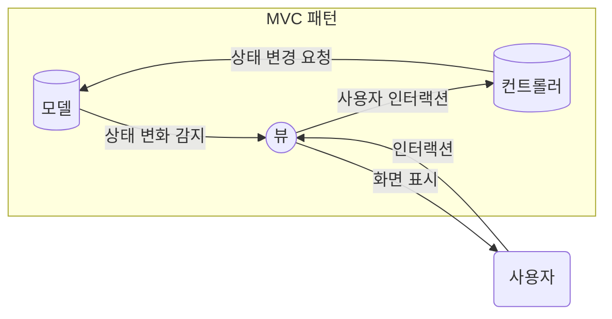
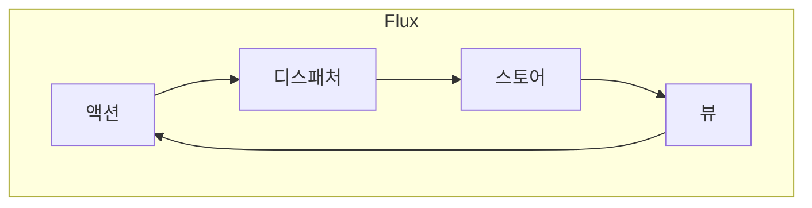

# 05장: 리액트와 상태 관리 라이브러리

<br>

- [05장: 리액트와 상태 관리 라이브러리](#05장-리액트와-상태-관리-라이브러리)
  - [5.1 상태 관리는 왜 필요한가?](#51-상태-관리는-왜-필요한가)
    - [5.1.1 리액트 상태 관리의 역사](#511-리액트-상태-관리의-역사)
    - [5.1.2 Flux 패턴의 등장](#512-flux-패턴의-등장)
  - [상태 관리 라이브러리 변화](#상태-관리-라이브러리-변화)
    - [Redux](#redux)
    - [`Redux Toolkit`](#redux-toolkit)
    - [`Context API`와 `useContext`](#context-api와-usecontext)
    - [`react-query`](#react-query)
    - [`SWR`](#swr)
    - [`Recoil`, `Jotai`, `Zustand`](#recoil-jotai-zustand)
  - [5.2 리액트 훅으로 시작하는 상태 관리](#52-리액트-훅으로-시작하는-상태-관리)
    - [5.2.1 가장 기본적인 방법: `useState`와 `useReducer`](#521-가장-기본적인-방법-usestate와-usereducer)
    - [5.2.2 지역 상태의 한계를 벗어나보자: `useState`의 상태를 바깥으로 분리하기](#522-지역-상태의-한계를-벗어나보자-usestate의-상태를-바깥으로-분리하기)
    - [5.2.3 `useState`와 `Context`를 동시에 사용해 보기](#523-usestate와-context를-동시에-사용해-보기)
    - [5.2.4 상태 관리 라이브러리 `Recoil`, `Jotai`, `Zustand` 살펴보기](#524-상태-관리-라이브러리-recoil-jotai-zustand-살펴보기)
  - [References](#references)

<br>

## 5.1 상태 관리는 왜 필요한가?

### 5.1.1 리액트 상태 관리의 역사

**[MVC 패턴]**

MVC 패턴은 Model-View-Controller의 약자로, 소프트웨어 설계를 위한 아키텍처 패턴 중 하나입니다.

- **모델(Model)**: 애플리케이션의 데이터와 비즈니스 로직을 관리합니다. 모델은 데이터의 상태 변화를 감지하고 이를 뷰에 알립니다.
- **뷰(View)**: 사용자에게 정보를 표시하고, 사용자로부터의 인터랙션을 받습니다. 뷰는 모델로부터 상태 변화를 감지하여 화면을 새롭게 렌더링합니다.
- **컨트롤러(Controller)**: 사용자의 인터랙션을 받아 처리하고, 모델에 상태 변경을 요청합니다.
- **사용자(User)**: 시스템과 상호작용하는 외부 주체로, 뷰를 통해 시스템과 소통합니다.



- 모델은 데이터와 비즈니스 로직을 담당
- 뷰는 사용자 인터페이스를 담당
- 컨트롤러는 사용자 입력에 따른 모델과 뷰 업데이트를 담당

### 5.1.2 Flux 패턴의 등장

- **React 애플리케이션의 복잡성 증가**: React 애플리케이션이 커질수록 컴포넌트 트리가 점점 복잡해집니다. 특히 대규모 애플리케이션에서는 수많은 컴포넌트간에 데이터를 전달하는 일이 복잡할 수 있습니다. 예를 들어, 쇼핑몰 애플리케이션의 경우 제품 리스트, 장바구니, 주문, 배송 추적 등 수많은 컴포넌트가 중첩되어 있고, 이들 사이에 제품 데이터, 주문 데이터 등이 오고 가야 합니다.
- **데이터 흐름 추적의 어려움**: 컴포넌트간의 복잡한 데이터 흐름으로 인해 변경 사항을 추적하고 디버깅 하는 것이 어려워집니다. 문제가 발생한 지점을 찾기 어렵습니다. 위의 예에서 장바구니에 제품을 추가했는데 주문 컴포넌트에 반영이 안되는 경우, 문제의 원인을 찾기 어려울 것입니다.

**[Flux 패턴의 등장]**
Flux 패턴은 이러한 문제를 해결하기 위해 도입되었습니다. Flux는 애플리케이션의 모든 데이터 흐름을 단방향으로 제한합니다.

- **액션(Action)**: 사용자 인터랙션이나 서버로부터의 데이터 업데이트 등을 트리거로 발생합니다.
- **디스패처(Dispatcher)**: 액션을 받아 스토어로 전달하는 중앙 허브입니다.
- **스토어(Store)**: 애플리케이션의 상태를 관리하며, 상태 변화가 있을 때 뷰를 업데이트하도록 합니다.
- **뷰(View)**: 사용자에게 정보를 표시하고, 사용자 인터랙션을 통해 새로운 액션을 발생시킬 수 있습니다.



- 사용자 인터랙션이 발생하면 View가 Action을 호출합니다.
- Action은 필요한 데이터 처리 로직을 수행 후 Dispatcher에게 전달합니다.
- Dispatcher는 여러 Store들에게 액션에 따라 상태 업데이트를 요청합니다.
- Store들은 새 상태로 업데이트 되고 View들은 이를 구독하여 렌더링을 업데이트 합니다.

**[Flux 아키텍처의 장점]**

- 데이터 흐름 추적 용이
- 디버깅 용이
- 전역 상태 관리 용이

Flux 아키텍처는 복잡한 데이터 흐름을 단순화하고 애플리케이션을 훨씬 더 잘 관리할 수 있게 해줍니다. 특히 대규모 애플리케이션에서 Flux 패턴의 장점이 크게 부각됩니다.

**[Flux 패턴의 한계]**

- **복잡한 구조**: Flux는 명확한 데이터 흐름을 제공하지만, 그 과정에서 액션(Action), 디스패처(Dispatcher), 스토어(Store), 뷰(View) 등 여러 구성 요소들을 직접 관리해야 합니다. 각각의 역할과 상호작용이 복잡하며, 이로 인해 많은 보일러플레이트 코드를 작성하게 됩니다.
- **불필요한 코드**: 작은 규모의 프로젝트에서는 Flux의 모든 구성 요소를 사용하는 것이 과도할 수 있습니다. 이 경우, 애플리케이션의 복잡도가 불필요하게 증가하며, 간단한 기능에 대해 과도한 양의 코드를 작성하게 될 수 있습니다.
- **상태 관리 라이브러리의 필요성**: Flux를 수동으로 구현하는 것은 많은 코드를 요구하기 때문에, 이를 해결하기 위해 다양한 상태 관리 라이브러리가 등장했습니다. 이 라이브러리들은 Flux 아키텍처를 기반으로 하면서도, 개발자가 보다 쉽게 상태 관리를 할 수 있도록 돕습니다.

**[React에서 MVC 패턴과 Flux 패턴의 차이점]**

| 차이점           | MVC 패턴               | Flux 패턴                |
| :--------------- | :--------------------- | :----------------------- |
| 데이터 흐름      | 양방향                 | **단방향**               |
| 아키텍처 중심    | 모델 중심              | **스토어 중심**          |
| 뷰 업데이트 방식 | 모델 변화 감지         | **스토어 구독**          |
| 상태 관리        | 모델 담당              | **전용 스토어**          |
| 디버깅 용이성    | 복잡한 흐름으로 어려움 | **단순한 흐름으로 용이** |

## 상태 관리 라이브러리 변화

### Redux

Redux는 Flux 아키텍처의 아이디어를 발전시키고 Elm의 함수형 프로그래밍 패러다임을 차용하여 복잡성을 줄인 자바스크립트 라이브러리입니다.

**[액션(Action)]**
액션은 상태 변화를 일으키는 이벤트를 설명하는 객체입니다. 모든 액션 객체는 type 필드를 가지며, 이는 발생하는 변화의 종류를 식별하는 데 사용됩니다. 때때로 액션은 변화를 일으키는 데 필요한 추가 데이터도 포함할 수 있습니다.

| 키(Key)            | 설명(Description)                             |
| ------------------ | --------------------------------------------- |
| `type`             | 발생하는 변화의 종류를 식별하는 문자열입니다. |
| `payload` (선택적) | 액션과 함께 전달되는 데이터입니다.            |

```javascript
const action = {
  type: "ADD_TODO",
  payload: "Learn Redux",
};
```

**[디스패처(Dispatcher)]**
디스패처는 액션을 스토어로 전달하는 역할을 합니다. Redux에서는 디스패처를 직접 다루지 않고, `dispatch` 함수를 사용하여 액션을 발송합니다.

| 메소드(Method)     | 설명(Description)                             |
| ------------------ | --------------------------------------------- |
| `dispatch(action)` | 액션을 발송하여 상태를 변경하도록 요청합니다. |

```javascript
dispatch({ type: "INCREMENT" });
```

**[리듀서(Reducer)]**
리듀서는 액션의 종류에 따라 상태를 어떻게 업데이트할지 정의합니다. 리듀서는 이전 상태와 액션 객체를 받아서 새로운 상태를 반환합니다.

| 키(Key)  | 설명(Description)       |
| -------- | ----------------------- |
| `state`  | 현재 상태값입니다.      |
| `action` | 처리할 액션 객체입니다. |

```javascript
function counter(state = 0, action) {
  switch (action.type) {
    case "INCREMENT":
      return state + 1;
    case "DECREMENT":
      return state - 1;
    default:
      return state;
  }
}
```

**[스토어(Store)]**
스토어는 애플리케이션의 상태를 저장하는 컨테이너입니다. Redux에서는 오직 하나의 스토어만이 존재하며, 이 스토어 안에 모든 애플리케이션 상태가 중앙집중식으로 관리됩니다.

| 메소드(Method)                | 설명(Description)                              |
| ----------------------------- | ---------------------------------------------- |
| `getState()`                  | 현재 상태값을 반환합니다.                      |
| `dispatch(action)`            | 액션을 발송하여 상태를 변경하도록 요청합니다.  |
| `subscribe(listener)`         | 상태 변경을 구독하는 리스너 함수를 등록합니다. |
| `replaceReducer(nextReducer)` | 현재 리듀서를 새로운 리듀서로 교체합니다.      |

```javascript
import { createStore } from "redux";

const store = createStore(counter);
```

**[Redux의 장점]**

| 장점                     | 상세 설명                                                                                                                          |
| ------------------------ | ---------------------------------------------------------------------------------------------------------------------------------- |
| 단방향 데이터 흐름       | 모든 데이터는 일정한 순서를 따라 흐르며, 이는 애플리케이션의 상태를 예측하고 이해하기 쉽게 만듭니다.                               |
| 상태의 중앙집중식 저장소 | 하나의 큰 상태 객체에 모든 상태 정보가 저장되어 있어, 상태 관리를 일관되게 할 수 있으며, 어디서든 동일한 상태에 접근이 가능합니다. |
| 리듀서의 순수성          | 리듀서는 순수 함수로서, 같은 인자에 대해 항상 동일한 결과를 반환합니다. 이는 테스트와 버그 추적을 간단하게 만들어줍니다.           |
| 디버깅                   | 개발 도구를 통해 이전 상태로 쉽게 돌아갈 수 있으며, 액션과 상태 변화를 시각적으로 확인할 수 있습니다.                              |
| 미들웨어 지원            | Redux 미들웨어를 통해 로깅, 크래시 리포팅, 비동기 API 호출 등 다양한 부가 기능을 쉽게 추가할 수 있습니다.                          |
| 커뮤니티의 활발성        | Redux는 널리 사용되고 있으며, 많은 개발자와 회사가 사용하고 지원하는 활발한 생태계를 갖추고 있습니다.                              |

**[Redux의 한계]**

| 한계           | 상세 설명                                                                                                                                                    |
| -------------- | ------------------------------------------------------------------------------------------------------------------------------------------------------------ |
| 복잡성         | Redux 자체의 개념과 함께 액션, 리듀서, 스토어 등을 관리해야 하는 부담이 있으며, 큰 애플리케이션에서는 이러한 복잡성이 더욱 증가합니다.                       |
| 보일러플레이트 | 액션 타입, 액션 생성자, 리듀서 등을 매번 정의해야 하며, 이는 코드량을 늘리고 반복적인 작업을 요구합니다.                                                     |
| 학습 곡선      | Redux의 개념과 패턴을 처음 접하는 개발자에게는 학습하기 어려울 수 있으며, 이로 인해 프로젝트 초기에 시간이 더 소요될 수 있습니다.                            |
| 비동기 로직    | 기본적으로 Redux는 동기적인 상태 업데이트만을 지원하기 때문에, 비동기 작업 처리를 위해서는 `redux-thunk`, `redux-saga` 같은 추가 미들웨어를 사용해야 합니다. |

### `Redux Toolkit`

Redux Toolkit은 Redux를 사용할 때 발생하는 보일러플레이트 코드를 줄이고, 개발자가 보다 쉽게 상태 관리를 할 수 있도록 돕는 라이브러리입니다.

**[Redux Toolkit의 주요 기능]**

- **`configureStore`**: Redux 스토어를 생성하는 함수로, 기본적으로 Redux 스토어를 생성하고, 미들웨어를 추가하며, 개발자 도구를 활성화합니다.
- **`createSlice`**: 리듀서와 액션을 한 곳에서 정의할 수 있도록 도와주는 함수로, 리듀서와 액션을 한 곳에서 정의할 수 있도록 도와줍니다.
- **`createAsyncThunk`**: 비동기 작업을 처리하는 액션 생성자를 생성하는 함수로, 비동기 작업을 처리하는 액션 생성자를 생성할 수 있도록 도와줍니다.
- **`createEntityAdapter`**: 정규화된 상태를 관리하는 데 도움을 주는 함수로, 정규화된 상태를 관리하는 데 도움을 주는 함수로, 엔티티를 관리하는 데 도움을 줍니다.
- **`createSelector`**: 리덕스 스토어의 상태를 선택하는 함수를 생성하는 함수로, 리덕스 스토어의 상태를 선택하는 함수를 생성할 수 있도록 도와줍니다.
- **`createReducer`**: 리듀서를 생성하는 함수로, 리듀서를 생성할 수 있도록 도와줍니다.
- **`createAction`**: 액션을 생성하는 함수로, 액션을 생성할 수 있도록 도와줍니다.

```javascript
import {
  configureStore,
  createSlice,
  createAsyncThunk,
  createEntityAdapter,
  createSelector,
  createReducer,
  createAction,
} from "@reduxjs/toolkit";

const todosAdapter = createEntityAdapter();

const fetchTodos = createAsyncThunk("todos/fetchTodos", async () => {
  const response = await fetch("https://jsonplaceholder.typicode.com/todos");
  const data = await response.json();
  return data;
});

const todosSlice = createSlice({
  name: "todos",
  initialState: todosAdapter.getInitialState(),
  reducers: {
    addTodo: todosAdapter.addOne,
    removeTodo: todosAdapter.removeOne,
  },
  extraReducers: (builder) => {
    builder.addCase(fetchTodos.fulfilled, (state, action) => {
      todosAdapter.setAll(state, action.payload);
    });
  },
});

const selectTodos = createSelector(
  (state) => state.todos,
  (todos) => todosAdapter.getSelectors().selectAll(todos)
);

const store = configureStore({
  reducer: createReducer(todosSlice.reducer),
  middleware: (getDefaultMiddleware) =>
    getDefaultMiddleware().concat(fetchTodos),
});

export const { addTodo, removeTodo } = todosSlice.actions;
export { fetchTodos, selectTodos };
```

**[Redux Toolkit의 장점]**

| 장점                    | 상세 설명                                                                                                                                |
| ----------------------- | ---------------------------------------------------------------------------------------------------------------------------------------- |
| 보일러플레이트 감소     | Redux Toolkit은 보일러플레이트 코드를 줄여주기 때문에, Redux를 사용할 때 발생하는 반복적인 코드 작성을 줄일 수 있습니다.                 |
| 학습 곡선 감소          | Redux Toolkit은 Redux의 개념과 패턴을 처음 접하는 개발자에게 학습하기 쉽도록 도와주기 때문에, 프로젝트 초기에 시간을 절약할 수 있습니다. |
| 비동기 로직 간소화      | Redux Toolkit은 비동기 작업 처리를 위한 `createAsyncThunk` 함수를 제공하기 때문에, 비동기 작업 처리를 간소화할 수 있습니다.              |
| 정규화된 상태 관리 지원 | Redux Toolkit은 `createEntityAdapter` 함수를 제공하기 때문에, 정규화된 상태를 관리하는 데 도움을 줄 수 있습니다.                         |

**[Redux Toolkit의 한계]**

| 한계        | 상세 설명                                                                                                                                         |
| ----------- | ------------------------------------------------------------------------------------------------------------------------------------------------- |
| 복잡성      | Redux Toolkit은 Redux의 개념과 함께 액션, 리듀서, 스토어 등을 관리해야 하는 부담이 있으며, 큰 애플리케이션에서는 이러한 복잡성이 더욱 증가합니다. |
| 학습 곡선   | Redux Toolkit은 Redux의 개념과 패턴을 처음 접하는 개발자에게는 학습하기 어려울 수 있으며, 이로 인해 프로젝트 초기에 시간이 더 소요될 수 있습니다. |
| 비동기 로직 | 기본적으로 Redux Toolkit은 동기적인 상태 업데이트만을 지원하기 때문에, 비동기 작업 처리를 위해서는 `createAsyncThunk` 함수를 사용해야 합니다.     |

### `Context API`와 `useContext`

`Context API`는 리액트에서 전역 상태를 관리하기 위한 방법으로, 컴포넌트 트리 전체에 데이터를 제공하는 컨텍스트를 만들고, 이를 통해 데이터를 전달할 수 있습니다.

`useContext`는 `Context API`를 사용하여 컴포넌트에서 컨텍스트 값을 읽어오는 훅입니다.

```javascript
import React, { createContext, useContext } from "react";

const ThemeContext = createContext("light");

function App() {
  return (
    <ThemeContext.Provider value="dark">
      <Toolbar />
    </ThemeContext.Provider>
  );
}

function Toolbar() {
  const theme = useContext(ThemeContext);
  return <div>Theme: {theme}</div>;
}
```

**[Context API의 장점]**

| 장점                              | 상세 설명                                                                                      |
| --------------------------------- | ---------------------------------------------------------------------------------------------- |
| 별도의 상태관리 라이브러리 불필요 | Context API를 사용하여 전역 상태 관리가 가능하므로 별도의 상태관리 라이브러리가 필요 없습니다. |
| 컴포넌트간 데이터 전달 용이       | Context를 통해 컴포넌트 트리 상위에서 하위 컴포넌트로 데이터를 전달할 수 있습니다.             |
| 컴포넌트간 데이터 공유 용이       | Context를 통해 동일한 데이터를 여러 컴포넌트에서 공유할 수 있습니다.                           |

**[Context API의 한계]**

| 한계                | 상세 설명                                                               |
| ------------------- | ----------------------------------------------------------------------- |
| 복잡성 증가         | 전역 상태 관리 시 복잡한 로직이 필요하거나 코드량이 많아질 수 있습니다. |
| 성능 문제 발생 가능 | 불필요한 리렌더링이 발생할 수 있습니다.                                 |

**[useContext의 장점]**

| 장점                              | 상세 설명                                                                                        |
| --------------------------------- | ------------------------------------------------------------------------------------------------ |
| 별도의 상태관리 라이브러리 불필요 | useContext를 사용하여 전역 상태를 구독할 수 있으므로 별도의 상태관리 라이브러리가 필요 없습니다. |
| 컴포넌트간 데이터 전달 용이       | Context 내부 값을 쉽게 사용할 수 있습니다.                                                       |
| 컴포넌트간 데이터 공유 용이       | 동일한 Context를 구독하는 컴포넌트들 사이에서 데이터를 공유할 수 있습니다.                       |

**[useContext의 한계]**

| 한계                     | 상세 설명                                                                                                                  |
| ------------------------ | -------------------------------------------------------------------------------------------------------------------------- |
| 전역 상태 관리 기능 없음 | useContext 자체로는 전역 상태를 관리할 수 없고 오직 읽기만 가능합니다. 전역 상태 관리를 위해서는 Context API가 필요합니다. |
| 최적화 필요              | 불필요한 리렌더링이 발생할 수 있으므로 성능 최적화를 위한 추가 작업이 필요할 수 있습니다.                                  |

**[Redux Toolkit, Context API, useContext의 차이점]**
| 차이점 | Redux Toolkit | Context API | useContext |
| ------ | ------------- | ----------- | ---------- |  
| 상태 관리 방식 | 전역 상태 관리 | 전역 상태 관리 | 전역 상태 읽기 |
| 별도의 상태 관리 라이브러리 필요성 | 줄어듦 | 줄어듦 | 변화 없음 |
| 복잡성 | 다소 증가 | 다소 증가 | 복잡성 증가 없음 |
| 성능 문제 발생 가능성 | 있음 | 있음 | 거의 없음 |

### `react-query`

`react-query`는 데이터를 가져오고 캐시하고 업데이트하는 데 사용되는 라이브러리로, 서버에서 데이터를 가져오는 로직을 추상화하고, 컴포넌트에서 데이터를 가져오는 로직을 분리하여 관리할 수 있도록 돕습니다.

**[react-query의 주요 기능]**

- **`useQuery`**: 데이터를 가져오는 Hook으로, 서버 API 호출을 추상화하여 컴포넌트에서 데이터 페칭 로직을 분리할 수 있게 해줍니다.

- **`useMutation`**: 데이터를 업데이트하는 Hook으로, 데이터 변경 로직을 추상화하여 컴포넌트에서 데이터 업데이트 로직을 분리할 수 있게 해줍니다.

- **`useQueryClient`**: 쿼리 클라이언트에 접근할 수 있는 Hook으로, 이를 사용하여 캐시된 데이터를 수동으로 업데이트하거나 인위적으로 페칭하게 할 수 있습니다.

```js
import { useQuery, useMutation, useQueryClient } from "react-query";

function Todos() {
  // 데이터 페칭
  const { data } = useQuery("todos", fetchTodos);

  // 데이터 업데이트
  const mutation = useMutation(updateTodo);

  // 쿼리 클라이언트
  const queryClient = useQueryClient();
}
```

**[react-query의 장점]**

| 장점                                    | 상세 설명                                                                          |
| --------------------------------------- | ---------------------------------------------------------------------------------- |
| 별도의 상태 관리 라이브러리 필요성 감소 | 데이터 페칭 및 캐싱 기능을 제공하므로 별도의 상태 관리 라이브러리가 필요 없습니다. |
| 데이터 페칭 로직 분리                   | 컴포넌트 밖에서 데이터 페칭 로직을 분리해서 작성할 수 있습니다.                    |
| 데이터 캐싱 및 업데이트 기능 제공       | 데이터를 캐싱하고 자동으로 업데이트해주는 기능을 제공합니다.                       |

**[react-query의 한계]**

| 한계                | 상세 설명                                                                        |
| ------------------- | -------------------------------------------------------------------------------- |
| 복잡성 증가         | 쿼리 작성 시 복잡한 로직이 필요하거나 코드량이 많아질 수 있습니다.               |
| 성능 문제 발생 가능 | 불필요한 리렌더링이 발생할 수 있으며 캐싱 전략에 따라 성능이 저하될 수 있습니다. |

### `SWR`

`SWR`은 데이터를 가져오고 캐시하고 업데이트하는 데 사용되는 라이브러리로, 서버에서 데이터를 가져오는 로직을 추상화하고, 컴포넌트에서 데이터를 가져오는 로직을 분리하여 관리할 수 있도록 돕습니다.

**[SWR의 주요 기능]**

- **`useSWR`**: 데이터를 가져오는 훅으로, 데이터를 가져오는 로직을 추상화하고, 컴포넌트에서 데이터를 가져오는 로직을 분리하여 관리할 수 있도록 돕습니다.

```javascript
import useSWR from "swr";

function Todos() {
  const { data, error } = useSWR("https://jsonplaceholder.typicode.com/todos");

  if (error) return "Error!";

  if (!data) return "Loading...";

  return (
    <ul>
      {data.map((todo) => (
        <li key={todo.id}>{todo.title}</li>
      ))}
    </ul>
  );
}
```

**[SWR의 장점]**

| 장점                              | 상세 설명                                                                             |
| --------------------------------- | ------------------------------------------------------------------------------------- |
| 별도의 상태관리 라이브러리 불필요 | 데이터 페칭 및 캐싱 기능을 제공하므로 별도의 상태관리 라이브러리가 필요하지 않습니다. |
| 데이터 페칭 로직 분리 용이        | 컴포넌트 밖에서 데이터 페칭 로직을 분리해서 작성할 수 있습니다.                       |

**[SWR의 한계]**

| 한계                | 상세 설명                                                                               |
| ------------------- | --------------------------------------------------------------------------------------- |
| 복잡성 증가         | 캐싱 전략 및 데이터 페칭 시 복잡한 로직이 필요할 수 있으며 코드량이 많아질 수 있습니다. |
| 성능 문제 발생 가능 | 불필요한 리렌더링이나 캐싱 전략에 따라 성능이 저하될 수 있습니다.                       |

### `Recoil`, `Jotai`, `Zustand`

`Recoil`, `Jotai`, `Zustand`는 리액트 상태 관리 라이브러리로, 전역 상태를 관리하는 데 사용됩니다.

**[Recoil의 주요 개념]**

- **`Atom`**: 상태를 정의하는 함수로, 전역 상태를 정의할 때 사용됩니다.
- **`Selector`**: 상태를 변환하는 함수로, 전역 상태를 변환할 때 사용됩니다.

```js
import { atom, selector, useRecoilState } from "recoil";

const textState = atom({
  key: "text",
  default: "",
});

const charCountState = selector({
  key: "charCount",
  get: ({ get }) => {
    const text = get(textState);
    return text.length;
  },
});

function TextInput() {
  const [text, setText] = useRecoilState(textState);

  return <input value={text} onChange={(e) => setText(e.target.value)} />;
}

function CharCount() {
  const count = useRecoilValue(charCountState);

  return <div>Character count: {count}</div>;
}
```

**[Jotai의 주요 개념]**

- **`Atom`**: 상태를 정의하는 함수로, 전역 상태를 정의할 때 사용됩니다.

```js
import { atom, useAtom } from "jotai";

const textState = atom("");

function TextInput() {
  const [text, setText] = useAtom(textState);

  // ...
}
```

**[Zustand의 주요 개념]**

- **`Store`**: 상태를 정의하는 함수로, 전역 상태를 정의할 때 사용됩니다.

```js
import create from "zustand";

const useStore = create((set) => ({
  text: "",
  updateText: (text) => set({ text }),
}));

function TextInput() {
  const { text, updateText } = useStore();

  return <input value={text} onChange={(e) => updateText(e.target.value)} />;
}
```

**[`Recoil`, `Jotai`, `Zustand`의 장점]**

| 장점                              | 상세 설명                                                                                                     |
| --------------------------------- | ------------------------------------------------------------------------------------------------------------- |
| 별도의 상태관리 라이브러리 불필요 | Recoil, Jotai, Zustand를 사용하여 전역 상태 관리가 가능하므로 별도의 상태관리 라이브러리가 필요하지 않습니다. |
| 데이터 페칭 로직 분리 용이        | 전역 상태의 데이터 페칭 및 업데이트 로직을 컴포넌트 밖에서 분리하여 작성할 수 있습니다.                       |
| 커뮤니티 지원                     | Recoil, Jotai, Zustand는 모두 활발한 커뮤니티를 보유하고 있어 문제 해결 및 지원을 받기 쉽습니다.              |
| 작은 번들 크기                    | 번들 크기가 작아 애플리케이션 성능 향상에 유리합니다.                                                         |
| 미들웨어 지원                     | 로깅, 에러 처리 등 다양한 미들웨어를 통해 기능 확장이 용이합니다.                                             |
| Recoil의 디버깅 지원              | Recoil은 타임 트래블 디버깅 등 상태 변화를 시각적으로 확인할 수 있는 다양한 디버깅 기능을 제공합니다.         |

**[`Recoil`, `Jotai`, `Zustand`의 한계]**

| 한계                | 상세 설명                                           |
| ------------------- | --------------------------------------------------- |
| 복잡성 증가         | 전역 상태 관리 시 복잡한 로직이 필요할 수 있습니다. |
| 성능 문제 발생 가능 | 불필요한 리렌더링이 발생할 수 있습니다.             |

<br>

## 5.2 리액트 훅으로 시작하는 상태 관리

Redux, MobX 등의 상태 관리 라이브러리들은 Flux 패턴의 아이디어를 발전시켜, 보다 단순화된 API와 향상된 사용자 경험을 제공합니다. 이러한 라이브러리들은 Flux의 단점을 극복하고, 애플리케이션 상태를 효율적으로 관리할 수 있도록 돕습니다.

### 5.2.1 가장 기본적인 방법: `useState`와 `useReducer`

`useState`와 `useReducer`는 리액트에서 상태를 관리하기 위한 훅으로, 각각의 특징에 따라 다양한 상황에서 사용됩니다.

**[`useState`의 특징]**

- **가장 기본적인 상태 관리 Hook**: `useState`는 리액트의 기본 내장 Hook으로, 함수 컴포넌트에서 가장 간단한 형태의 상태 관리를 할 수 있게 해줍니다.
- **로컬 상태 관리**: `useState`로 관리하는 상태는 해당 컴포넌트의 로컬 상태입니다. 전역 상태 관리 기능이 없습니다.
- **단순한 상태 관리**: 데이터 흐름이 단순한 경우에 적합합니다. 복잡한 상태 관리 시에는 다른 상태 관리 라이브러리를 고려할 수 있습니다.

```jsx
import React, { useState } from "react";

function Info() {
  const [name, setName] = useState("");
  const [nickname, setNickname] = useState("");

  return (
    <form>
      <fieldset>
        <legend>개인정보</legend>

        <label>
          이름:
          <input
            type="text"
            value={name}
            onChange={(e) => setName(e.target.value)}
          />
        </label>

        <label>
          닉네임:
          <input
            type="text"
            value={nickname}
            onChange={(e) => setNickname(e.target.value)}
          />
        </label>
      </fieldset>

      <div role="alert" aria-live="polite">
        <p>
          <b>이름:</b> {name}
        </p>
        <p>
          <b>닉네임:</b> {nickname}
        </p>
      </div>
    </form>
  );
}

export default Info;
```

**[`useReducer`의 특징]**

- **복잡한 상태 관리**: `useReducer`는 복잡한 상태 변경 로직을 다룰 때 사용됩니다.
- **액션과 리듀서 기반**: 액션을 통해 리듀서 함수를 실행하여 상태를 업데이트합니다. 이를 통해 업데이트 로직을 분리할 수 있습니다.
- **성능 최적화**: 컴포넌트의 리렌더링 횟수를 줄일 수 있어 성능 최적화에 유리합니다.

```javascript
function reducer(state, action) {
  switch (action.type) {
    case "INCREMENT":
      return {
        count: state.count + 1,
      };
    case "DECREMENT":
      return {
        count: state.count - 1,
      };
    default:
      return state;
  }
}

function Counter() {
  const [state, dispatch] = useReducer(reducer, { count: 0 });

  function onIncrease() {
    dispatch({ type: "INCREMENT" });
  }

  function onDecrease() {
    dispatch({ type: "DECREMENT" });
  }

  return (
    <div>
      <p>현재 카운트: {state.count}</p>
      <button onClick={onIncrease}>증가</button>
      <button onClick={onDecrease}>감소</button>
    </div>
  );
}
```

**[`useState`와 `useReducer`의 차이점]**

| 차이점         | `useState`                                            | `useReducer`                                  |
| -------------- | ----------------------------------------------------- | --------------------------------------------- |
| 상태 관리 범위 | 컴포넌트 내부의 로컬 상태 관리                        | 컴포넌트 내부 및 전역 상태 관리 가능          |
| 복잡성         | 단순한 상태 관리에 적합                               | 복잡한 상태 관리에 적합                       |
| 성능           | 불필요한 리렌더링이 발생할 수 있어 성능 최적화에 취약 | 리렌더링을 최적화하기 쉬워 성능 최적화에 유리 |

```javascript
function CounterWithUseState() {
  const [count, setCount] = useState(0);

  return (
    <div>
      <p>{count}</p>
      <button onClick={() => setCount(count + 1)}>증가</button>
    </div>
  );
}

function reducer(state, action) {
  switch (action.type) {
    case "INCREMENT":
      return { count: state.count + 1 };
    default:
      return state;
  }
}

function CounterWithUseReducer() {
  const [state, dispatch] = useReducer(reducer, { count: 0 });

  return (
    <div>
      <p>{state.count}</p>
      <button onClick={() => dispatch({ type: "INCREMENT" })}>증가</button>
    </div>
  );
}
```

### 5.2.2 지역 상태의 한계를 벗어나보자: `useState`의 상태를 바깥으로 분리하기

```javascript
// store.js

import { create } from "zustand";

// 상태 관리를 위한 store 생성
const useNumberStore = create((set) => ({
  number: 0,
  increase: () => set((state) => ({ number: state.number + 1 })),
  decrease: () => set((state) => ({ number: state.number - 1 })),
}));

export default useNumberStore;
```

```javascript
// Component.js

import useNumberStore from "./store";

function MyComponent() {
  const { number, increase, decrease } = useNumberStore();

  return (
    <div>
      <h2>{number}</h2>
      <button onClick={increase}>증가</button>
      <button onClick={decrease}>감소</button>
    </div>
  );
}

export default MyComponent;
```

### 5.2.3 `useState`와 `Context`를 동시에 사용해 보기

```javascript
// store.js
import React, { createContext, useContext, useState } from "react";

const NumberStateContext = createContext();

// 상태 관리를 위한 Provider 생성
export function NumberProvider({ children }) {
  const [number, setNumber] = useState(0);

  return (
    <NumberStateContext.Provider value={{ number, setNumber }}>
      {children}
    </NumberStateContext.Provider>
  );
}

// 상태 관리를 위한 커스텀 훅 생성
export function useNumberState() {
  const context = useContext(NumberStateContext);
  if (!context) {
    throw new Error("useNumberState는 NumberProvider 안에서만 사용가능합니다.");
  }
  return context;
}
```

```javascript
// Component.js
import { useNumberState } from "./store";

function MyComponent() {
  const { number, setNumber } = useNumberState();

  return (
    <div>
      <h2>{number}</h2>
      <button onClick={() => setNumber(number + 1)}>증가</button>
      <button onClick={() => setNumber(number - 1)}>감소</button>
    </div>
  );
}

export default MyComponent;
```

### 5.2.4 상태 관리 라이브러리 `Recoil`, `Jotai`, `Zustand` 살펴보기

**[`Recoil`, `Jotai`, `Zustand` 세 가지 상태 관리 라이브러리의 차이점]**
| 차이점 | `Recoil` | `Jotai` | `Zustand` |
| ------------------- | ------------ | --------- | ------------------ |
| 제작사 | Facebook | PMNDRS | Kramer |
| 핵심 개념 | Atom, 선택기 | Atom | Store |
| 상태 공유 방식 | 전역 상태 | 전역 상태 | 중앙 집중식 저장소 |
| 학습 곡선 | 복잡 | 단순 | 단순 |
| 번들 크기 | 작음 | 가장 작음 | 작음 |
| 미들웨어 지원 | X | O | O |
| 타임 트래블 디버깅 | O | X | X |
| React 버전 요구사항 | 16.13+ | 16.8+ | 16.8+ |

**[Recoil]**

- **`Atom`**: 상태를 정의하는 함수로, 전역 상태를 정의할 때 사용됩니다.
- **`useRecoilState`**: 상태를 읽고 업데이트하는 훅으로, 전역 상태를 읽고 업데이트할 때 사용됩니다.
- **`useRecoilValue`**: 상태를 읽는 훅으로, 전역 상태를 읽을 때 사용됩니다.

```javascript
import { RecoilRoot, atom, useRecoilState, useSetRecoilState } from "recoil";

const countState = atom({
  key: "count",
  default: 0,
});

function Counter() {
  const [count, setCount] = useRecoilState(countState);

  const increaseCount = () => setCount(count + 1);

  return (
    <div>
      <span>{count}</span>
      <button onClick={increaseCount}>증가</button>
    </div>
  );
}

function App() {
  return (
    <RecoilRoot>
      <Counter />
    </RecoilRoot>
  );
}
```

**[Jotai]**

- **`Atom`**: 상태를 정의하는 함수로, 전역 상태를 정의할 때 사용됩니다.
- **`useAtom`**: 상태를 읽고 업데이트하는 훅으로, 전역 상태를 읽고 업데이트할 때 사용됩니다.
- **`useAtomValue`**: 상태를 읽는 훅으로, 전역 상태를 읽을 때 사용됩니다.

```javascript
import { atom, useAtom } from "jotai";

const countAtom = atom(0);

function Counter() {
  const [count, setCount] = useAtom(countAtom);

  const increaseCount = () => setCount(count + 1);

  return (
    <div>
      <span>{count}</span>
      <button onClick={increaseCount}>증가</button>
    </div>
  );
}

function App() {
  return <Counter />;
}
```

**[Zustand]**

- **`Store`**: 상태를 정의하는 함수로, 전역 상태를 정의할 때 사용됩니다.
- **`useStore`**: 상태를 읽고 업데이트하는 훅으로, 전역 상태를 읽고 업데이트할 때 사용됩니다.
- **`useStoreState`**: 상태를 읽는 훅으로, 전역 상태를 읽을 때 사용됩니다.

```javascript
import create from "zustand";

const useStore = create((set) => ({
  count: 0,
  increase: () => set((state) => ({ count: state.count + 1 })),
}));

function Counter() {
  const { count, increase } = useStore();

  return (
    <div>
      <span>{count}</span>
      <button onClick={increase}>증가</button>
    </div>
  );
}

function App() {
  return <Counter />;
}
```

<br>

## References

- [React 공식 문서](https://ko.reactjs.org/)
- [Redux 공식 문서](https://redux.js.org/)
  - [Redux History and Design - Prior Art](https://redux.js.org/understanding/history-and-design/prior-art)
  - [Redux History and Design - Prior Art(ko)](https://ko.redux.js.org/understanding/history-and-design/prior-art/)

<br>

[⬆️ TOP](#05장-리액트와-상태-관리-라이브러리)
